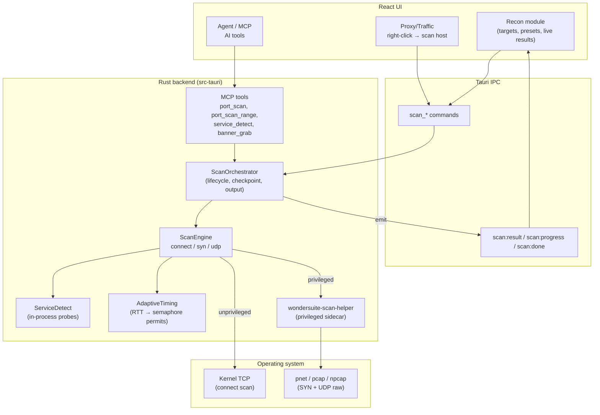
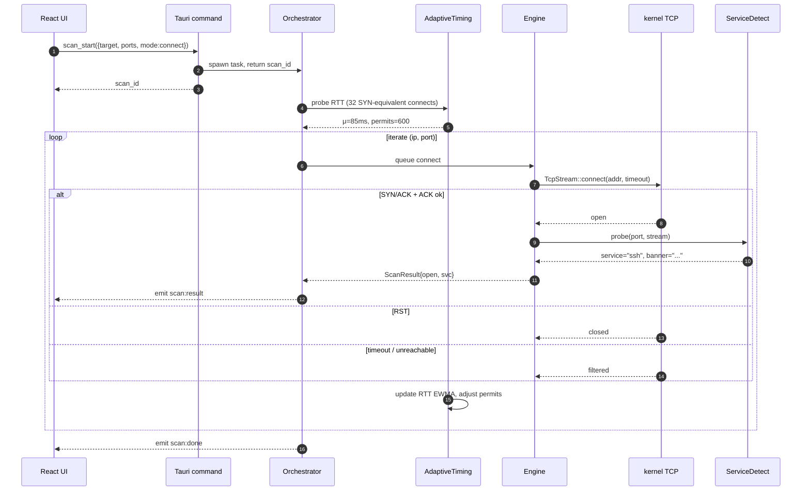
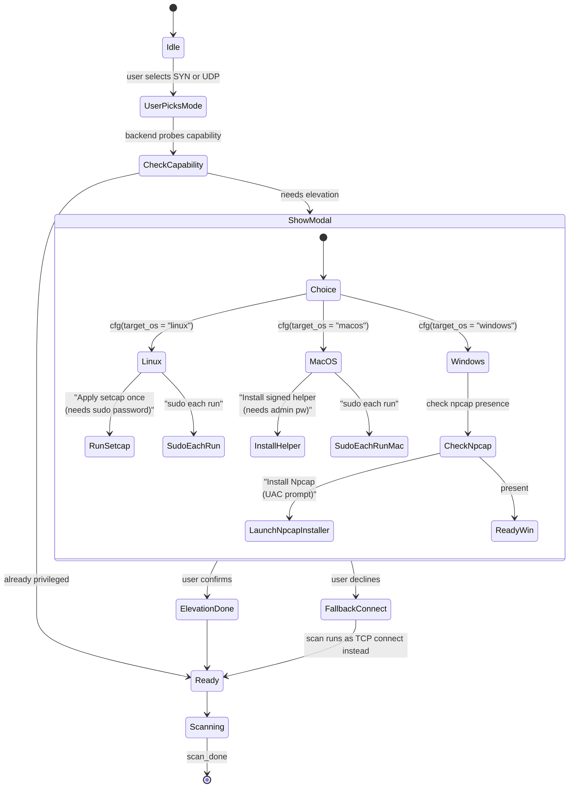
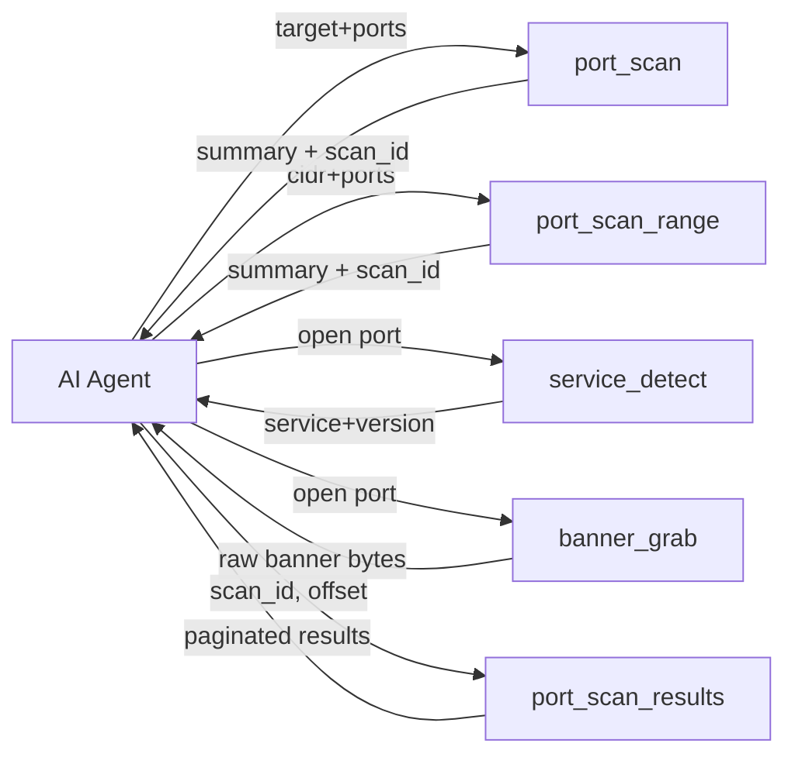
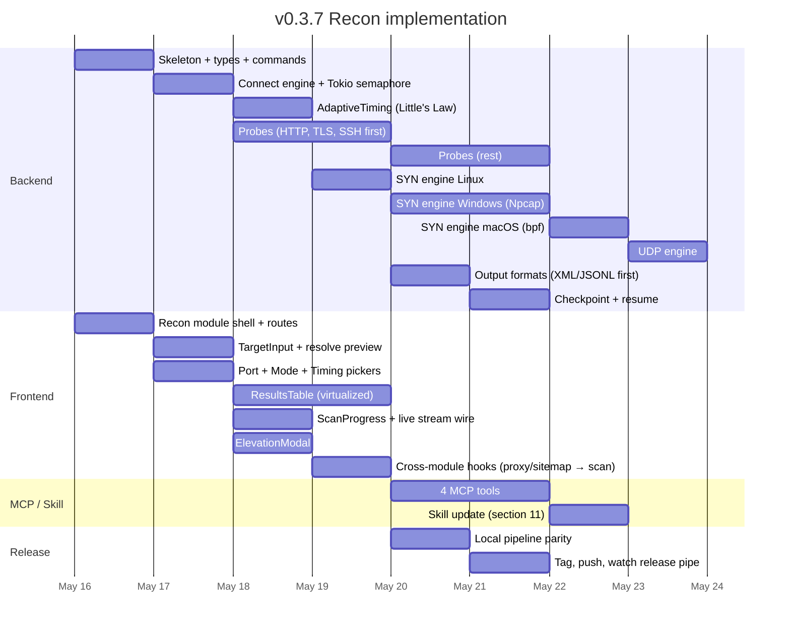

# WonderSuite v0.3.7 — Port Scanner ("Recon") Implementation Plan

> Target: in-process port scanner that beats RustScan on speed *and* UX, embedded in WonderSuite. Same Tauri 2 binary, same Rust backend, same React UI patterns we already ship. Module name in the sidebar: **Ports** (Testing group, between Scanner and WebSocket). ModuleId: `ports`.

---

## 1. Why this is worth doing

RustScan's three real flaws map cleanly to our existing strengths:

1. **No adaptive concurrency.** `batch_size` is fixed at startup via `infer_batch_size` (see [`src/main.rs`](https://github.com/bee-san/RustScan/blob/master/src/main.rs)). Network conditions change mid-scan — the in-flight count doesn't. We fix this with an RTT-driven `Semaphore` permit controller (Little's Law).
2. **Pipes to nmap subprocess for service detection.** Slow (fork/exec + XML parse), brittle (exit-127 user issue [#862](https://github.com/bee-san/RustScan/issues/862)), and leaks the recon flow out of the tool. We embed the probes in Rust.
3. **CLI-shaped, async-std-only.** No streaming result API, no resume, no IPv6-first design, no cross-window UX. We already have a Tauri IPC event bus + multi-window (v0.3.6/0.3.7) — port scan results streaming live into a results table is a 50-LoC patch on infrastructure we already have.

Plus: **WonderSuite already has the proxy, sitemap, scanner, findings + MCP server.** A built-in port scanner closes the loop: see a host in proxy traffic → right-click → "Scan ports" → results land in Recon module → click open port → "Send to Scanner" → done. RustScan has none of that.

---

## 2. Architecture at a glance



---

## 3. Scan modes — capability matrix

| Mode | Speed | Stealth | Needs admin | OS support | Use case |
|---|---|---|---|---|---|
| **TCP connect** | ★★★☆☆ (kernel TCP, ephemeral-port limited on Windows) | ★☆☆☆☆ (full handshake, log-visible) | No | Win/macOS/Linux | Default, "just works" |
| **TCP SYN** | ★★★★★ (raw, no kernel TCP state) | ★★★☆☆ (no full handshake, but not anonymous) | Yes | Win (Npcap), macOS (bpf), Linux (CAP_NET_RAW) | Power scan, large ranges |
| **UDP** | ★★☆☆☆ (ICMP rate-limited by target kernel) | ★★☆☆☆ | Yes (raw send/recv for ICMP unreach) | Win (Npcap), macOS (bpf), Linux (CAP_NET_RAW) | DNS/SNMP/NTP/IPMI/SIP recon |
| **TLS-ALPN** *(stretch)* | n/a | ★★★★☆ | No | All | Verify HTTPS/H2/H3 on opens |

All three modes are surfaced. Default is TCP connect (no admin prompt). SYN / UDP prompts the elevation modal (§6).

---

## 4. Scan engine — connect-scan flow



**Concrete adapter to RustScan's pattern.** Where RustScan uses `FuturesUnordered` with fixed pre-fill, we use:

```rust
let sem = Arc::new(Semaphore::new(initial_permits));
for socket in iter {                          // (ip, port) tuples
    let permit = sem.clone().acquire_owned().await?;
    let tx = result_tx.clone();
    tokio::spawn(async move {
        let _p = permit;                       // dropped on completion → frees slot
        let res = connect_probe(socket, timeout).await;
        let _ = tx.send(res).await;
    });
}
```

Permit count is mutated live by the AdaptiveTiming task running in parallel — `sem.add_permits(delta)` or `sem.forget_permits(delta)`. RustScan can't do this because their bounded set's capacity is fixed at construction.

---

## 5. Service detection — probe pipeline

```mermaid
flowchart LR
    A["Port open<br/>(stream available)"] --> B{Server-first<br/>banner?}
    B -->|"<= 256 bytes in 500ms"| C[Match banner regex]
    B -->|silent| D{Port hints<br/>service?}
    D -->|"22→ssh<br/>80→http<br/>443→tls<br/>..."| E[Run port-specific probe]
    D -->|"unknown"| F[Run common probes<br/>HTTP → TLS → SSH banner]
    C --> G{matched?}
    E --> G
    F --> G
    G -->|yes| H[Extract product+version]
    G -->|no| I[Tag as 'tcp-open']
    H --> J[ServiceInfo]
    I --> J
    J --> K{TLS handshake<br/>succeeded?}
    K -->|yes| L[Parse cert<br/>(CN, SAN, expiry)]
    L --> J
```

**Probes shipped in v0.3.7** (Rust, no nmap subprocess): HTTP, TLS (with cert parse via `rustls`), SSH, FTP, SMTP, POP3, IMAP, MySQL, PostgreSQL, Redis, MongoDB, Memcached, RDP (X.224 CR TPDU), VNC, SMB Negotiate. Covers ~95% of services pentesters care about. Probe file is a Rust `phf::Map<u16, &[Probe]>` so new probes are a code change, not a config file.

Reference: nmap's [nmap-service-probes format](https://nmap.org/book/vscan-fileformat.html) — we mirror the matching semantics (rarity ≤ intensity), not the file format.

---

## 6. Permission elevation — modal flow



**Modal copy** (live wireframe):

```
┌──────────────────────────────────────────────────────┐
│  Privileged scan mode                                │
│                                                      │
│  SYN scanning sends raw TCP packets and needs        │
│  elevated network privileges:                        │
│                                                      │
│  [✓]  Faster — 5–10× speed vs TCP connect            │
│  [✓]  Stealthier — no full handshake                 │
│  [!]  Needs Administrator / sudo / Npcap             │
│                                                      │
│  How do you want to proceed?                         │
│                                                      │
│   [ Apply once — recommended ]                       │
│       Linux: sudo setcap on our scan-helper          │
│       macOS: install signed launchd helper           │
│       Windows: install bundled Npcap (UAC)           │
│                                                      │
│   [ Prompt every time ]                              │
│       Asks for password each scan                    │
│                                                      │
│   [ Fall back to TCP connect ]                       │
│       Slower, no admin needed                        │
│                                                      │
│  [ Don't ask me again for this session ]             │
└──────────────────────────────────────────────────────┘
```

**Backend support** (new commands):
- `scan_capability_check(mode) -> {available: bool, missing: ["npcap"|"cap_net_raw"|"helper"]}`
- `scan_elevate(strategy) -> {ok, error?}` — spawns helper installer / npcap setup
- `scan_capability_persist(mode) -> {ok}` — remembers chosen strategy in app config

---

## 7. UI — module layout

```
┌─ Recon (sidebar item, between OAST and Sitemap) ──────────────────────────────────┐
│                                                                                    │
│  ┌── Target ─────────────────────────────────────────────────────────────────────┐ │
│  │  10.0.0.0/24, example.com, 2606:4700::/32         [Resolve & expand → 256 IPs]│ │
│  └─────────────────────────────────────────────────────────────────────────────────┘ │
│                                                                                    │
│  ┌── Ports ────────────────┐  ┌── Mode ──────────────┐  ┌── Timing ─────────────┐ │
│  │ [ Top 100 ] [ Top 1000 ]│  │ ○ TCP connect  ✓     │  │ T0 ░ T1 ░ T2 ░ T3 ▓   │ │
│  │ [ Top 65k ] [ Custom ]  │  │ ○ TCP SYN  (admin)   │  │ T4 ▓ T5 ░ T6 ░         │ │
│  │  > 1-1024,3306,5432     │  │ ○ UDP       (admin)  │  │ Adaptive ▓ Idle-mode ░ │ │
│  └─────────────────────────┘  └──────────────────────┘  └────────────────────────┘ │
│                                                                                    │
│  ┌── Service detection ────┐  ┌── Output ────────────┐  [ ▶ Start scan ]  [ ⏸ ]   │
│  │ Intensity:  ▓▓▓▓▓░░░░ 5│  │ ☑ stream to UI       │                              │
│  │ ☑ TLS / cert parse     │  │ ☑ XML + JSON         │                              │
│  │ ☑ HTTP screenshot      │  │ ☐ Greppable          │                              │
│  └─────────────────────────┘  └──────────────────────┘                              │
│                                                                                    │
│  Progress: ████████████░░░░░░░░  62%  ·  13,422 / 21,600 probes  ·  1832 pps      │
│  RTT μ 85 ms p95 320 ms  ·  permits 612  ·  open 47  ·  filtered 8                │
│                                                                                    │
│  ┌─ Results (live) ──────────────────────────────────────────────────────────────┐ │
│  │ Host          Port  State    Service       Product   Version    Banner          │ │
│  │ 10.0.0.5     22    open     ssh           OpenSSH   9.6p1      SSH-2.0-…      │ │
│  │ 10.0.0.5     80    open     http          nginx     1.27.0     Server: nginx  │ │
│  │ 10.0.0.5     443   open     tls/h2        nginx     1.27.0     CN=site.com    │ │
│  │ 10.0.0.5     5432  open     postgres      PostgreSQL 16.2      …               │ │
│  │ 10.0.0.7     3389  filtered rdp           —         —           —              │ │
│  └────────────────────────────────────────────────────────────────────────────────┘ │
│                                                                                    │
│  [ Send open → Scanner ]  [ Export XML ]  [ Save scan ]  [ Resume… ]              │
└────────────────────────────────────────────────────────────────────────────────────┘
```

**Right-click on a result row**: Send to Repeater / Scanner / Intruder / Comparer; Copy as nmap command; Open in browser (HTTP/HTTPS only).

**Cross-module integration**:
- Proxy / Sitemap host → right-click → "Scan ports" → Recon tab opens pre-filled, scan starts
- Recon row → right-click → "Send to Scanner" → kicks our existing active scanner on the open port
- Findings auto-generated for: default-cred services seen, expired certs, anonymous FTP, unauthenticated Redis/Mongo/Memcached
- Sitemap nodes auto-tagged with discovered services

---

## 8. Output formats

Five formats, all shipping v0.3.7:

| Format | Use case | File |
|---|---|---|
| **Nmap XML** | `db_import` into Metasploit, parse with `python-libnmap` | `<scan_id>.xml` |
| **gnmap** | grep/awk pipelines | `<scan_id>.gnmap` |
| **JSON Lines** | `httpx -json`, `nuclei -j`, jq pipelines | `<scan_id>.jsonl` |
| **CSV** | Spreadsheet, ad-hoc analysis | `<scan_id>.csv` |
| **Plain `ip:port`** | `cat | httpx -ports -follow-redirects` | `<scan_id>.txt` |

Live-emit JSONL during scan; the others are materialized on "Save scan".

---

## 9. MCP tool surface

Adds 4 tools (current count 85 → **89**, matches the answered question):



**`port_scan`** — single host/hostname, returns summary + scan_id:
```jsonc
{
  "target": "example.com",
  "ports": "top-1000",      // or "80,443" / "1-1024"
  "mode": "connect",         // "syn" | "udp" — modal will be triggered if needed
  "timing": "T3",
  "service_detect": true
}
// → { "scan_id": "...", "total_open": 5, "sample": [...5 items], "elapsed_ms": 2840 }
```

**`port_scan_range`** — CIDR or list of hosts:
```jsonc
{
  "targets": ["10.0.0.0/24", "192.168.1.0/24"],
  "ports": "top-100",
  "exclude_cdn": true,
  "max_hosts": 4096
}
// → { "scan_id": "...", "hosts_alive": 17, "total_open": 134, "summary_by_service": {"http":40,"ssh":17,...} }
```

**`service_detect`** — surgical, no port scan needed (port assumed open):
```jsonc
{
  "host": "10.0.0.5",
  "port": 5432,
  "intensity": 7
}
// → { "service": "postgresql", "product": "PostgreSQL", "version": "16.2", "auth_required": true }
```

**`banner_grab`** — raw bytes only, no probe synthesis:
```jsonc
{
  "host": "10.0.0.5",
  "port": 22,
  "max_bytes": 256,
  "timeout_ms": 500
}
// → { "banner": "SSH-2.0-OpenSSH_9.6p1 Ubuntu-3ubuntu13.5\r\n", "is_text": true }
```

**`port_scan_results`** — paginate over a scan_id for drill-down:
```jsonc
{ "scan_id": "...", "offset": 50, "limit": 50, "state_filter": "open" }
```

All five emit `progress` notifications during execution (MCP streaming), so AI agents see partial results during long scans.

---

## 10. AI Skill update

Updates to `.claude/skills/wondersuite.md`:

1. **Tool count 85 → 89** (Browser MCP stays 24, Recon adds 4, Misc unchanged).
2. **New section "Port Recon"** with decision tree:
   ```
   Need port discovery?
     ├─ Single host, fast triage           → port_scan(target, ports="top-100")
     ├─ Subnet sweep                       → port_scan_range(targets, exclude_cdn=true)
     ├─ Already know port open, want svc   → service_detect(host, port)
     └─ Raw bytes for custom regex match   → banner_grab(host, port)
   ```
3. **Auto-Vulnerability-Hunt addition**: every open port → `service_detect` → if `auth_required:false` on a sensitive service (Redis, Mongo, Memcached, Elasticsearch, FTP anonymous) → emit finding via existing scanner-finding event.
4. **Privileged mode caveat**: AI should default to TCP connect (no elevation), only request SYN if user explicitly wants speed and has accepted the elevation modal.
5. **Workflow example** added: "Find auth surface on a target":
   ```
   1. port_scan_range(cidr, ports="top-1000", exclude_cdn=true)
   2. for each open port:
      service_detect(host, port)
      if service in [ssh,ftp,rdp,vnc,smb]: send_to_intruder(host:port, category="auth")
      if service in [http,https]: passive_scan, browser_open → vuln-hunt flow
   ```

---

## 11. Files to create / modify

```
src-tauri/src/
  portscan/
    mod.rs                  -- public API + types (ScanRequest, ScanResult, ScanState)
    orchestrator.rs         -- ScanOrchestrator: lifecycle, checkpoint, output fanout
    engine/
      mod.rs                -- trait Engine; dispatch by mode
      connect.rs            -- tokio TcpStream connect engine
      syn/mod.rs            -- raw SYN dispatch
      syn/linux.rs          -- AF_PACKET via pnet
      syn/macos.rs          -- bpf via pnet
      syn/windows.rs        -- Npcap via pcap crate
      udp.rs                -- UDP probe + ICMP unreach listener
    timing.rs               -- T0..T6 templates + AdaptiveTiming controller
    probes/
      mod.rs                -- ProbeRegistry, phf::Map<port, &[Probe]>
      http.rs tls.rs ssh.rs ftp.rs smtp.rs pop3.rs imap.rs
      mysql.rs postgres.rs redis.rs mongo.rs memcached.rs
      rdp.rs vnc.rs smb.rs
    output/
      mod.rs xml.rs gnmap.rs jsonl.rs csv.rs plain.rs
    cdn.rs                  -- embedded cdncheck phf::Map, build.rs codegen
    checkpoint.rs           -- resume state (scan_id, cursor, partial results)
    elevation.rs            -- capability_check / elevate / persist
  portscan_commands.rs      -- scan_start, scan_stop, scan_status, scan_resume,
                              scan_capability_check, scan_elevate,
                              scan_get_results, scan_export
  mcp/handlers/portscan/
    mod.rs port_scan.rs port_scan_range.rs service_detect.rs
    banner_grab.rs port_scan_results.rs
  lib.rs                    -- register module + invoke_handler + state

src-tauri/wondersuite-scan-helper/   -- new sidecar crate (privileged binary)
  Cargo.toml
  src/main.rs               -- IPC over unix socket / named pipe to main

src/modules/recon/
  Recon.tsx                 -- main module component
  Recon.css                 -- styles (matches existing module patterns)
  TargetInput.tsx           -- target with resolve/expand preview
  PortPicker.tsx            -- preset buttons + custom ranges
  ModePicker.tsx            -- 3 radio cards (Connect/SYN/UDP) with admin badges
  TimingPicker.tsx          -- T0–T6 slider, Adaptive + Idle toggles
  ResultsTable.tsx          -- virtualized table, right-click context menu
  ScanProgress.tsx          -- live progress bar with RTT/permits/pps
  ElevationModal.tsx        -- the modal from §6
src/components/layout/Sidebar.tsx   -- add Recon item (Recon group between Testing and Recon, idx 5)
src/components/layout/moduleMap.tsx -- register 'recon' lazy import
src/types/index.ts          -- add 'recon' to ModuleId union
src/stores/portscanStore.ts -- zustand store for active scans (live results)

.claude/skills/wondersuite.md      -- skill update (section 11)
src-tauri/src/commands.rs          -- skill_content includes new section

docs/v0.3.7-portscan-plan.md       -- this file
CHANGELOG.md                       -- [0.3.7] entry
package.json, src-tauri/Cargo.toml, src-tauri/tauri.conf.json, src-tauri/Cargo.lock
                                   -- bump 0.3.6 → 0.3.7
```

New cargo deps (added to `src-tauri/Cargo.toml`):

```toml
socket2   = "0.5"
pnet      = "0.34"
etherparse = "0.15"
rlimit    = "0.10"
phf       = { version = "0.11", features = ["macros"] }
phf_codegen = "0.11"   # build-dep
quick-xml = "0.36"
csv       = "1.3"
bson      = "2.13"

[target.'cfg(windows)'.dependencies]
pcap = "2.2"
```

---

## 12. Differentiator scorecard — WonderSuite vs RustScan vs nmap

| Capability | nmap | RustScan | **WonderSuite-Recon** |
|---|---|---|---|
| TCP connect scan | ✓ | ✓ | ✓ |
| TCP SYN scan | ✓ (root) | ✗ (pipes to nmap) | ✓ (in-process, all 3 OS) |
| UDP scan | ✓ (root) | ✗ | ✓ |
| Adaptive concurrency (RTT-driven) | partial | ✗ | **✓ (Little's Law)** |
| Live result streaming to UI | ✗ (CLI) | ✗ (final dump) | **✓ (Tauri events)** |
| Resume from interrupt | ✗ | ✗ | **✓ (checkpoint)** |
| IPv6 first-class | ✓ | partial | **✓ (from iter level)** |
| CDN dedup (Cloudflare etc.) | ✗ | ✗ | **✓ (cdncheck embed)** |
| In-process service detection | ✓ (probes file) | ✗ (calls nmap) | **✓ (15 probes in Rust)** |
| AI/MCP integration | n/a | n/a | **✓ (4 tools)** |
| Cross-module workflow (proxy → scan → repeater) | n/a | n/a | **✓** |
| Idle-mode (throttle while idle) | ✗ | ✗ | **✓** |
| Windows ephemeral-port handling (SO_LINGER trick) | partial | ✗ (dies fast on Windows) | **✓** |
| Pop-out into separate window (multi-monitor) | ✗ | ✗ | **✓ (v0.3.7 feature)** |
| Timing T0–T5 templates | ✓ | partial | ✓ + **T6 "ludicrous"** |
| Decoys, fragmentation, source-port spoof | ✓ | ✗ | ✓ (SYN-mode only) |
| XML / gnmap / JSONL / CSV / plain output | ✓ XML/gnmap | partial | **✓ all 5** |

---

## 13. Implementation milestones



Realistic ship target: **3–5 working days** if we don't get blocked on Npcap detection edge cases. SYN scan on Windows is the highest-risk component.

---

## 14. Risks + mitigations

| Risk | Severity | Mitigation |
|---|---|---|
| Npcap silent-install license forbids redistribution without OEM | High | Bundle the official Npcap installer EXE in resources, launch it via `runas`; never silent. Doc this in skill. |
| `pnet` on macOS 14+ requires entitlements signing | High | Two-tier: (1) ship a separate signed helper binary `wondersuite-scan-helper.app` installed via SMAppService; (2) fall back to "sudo each run" for unsigned dev builds. |
| Windows ephemeral port exhaustion on CONNECT scan | Medium | Auto-detect via `GetTcpStatistics2()`; warn user; apply SO_LINGER(1, 0) trick; suggest SYN mode as alternative. |
| `pcap` crate version mismatch with installed Npcap SDK on user machines | Medium | Pin Npcap 1.79 + pcap crate 2.2 + Packet.lib in resources/; runtime probe `wpcap.dll` version. |
| RTT-adaptive controller oscillates and never stabilizes on lossy networks | Medium | EWMA with α=0.2 + dead-band ±20% before permit change; floor 64, ceiling 65535 permits. |
| Probe regex set lags behind nmap's real-world coverage | Low | Ship 15 probes covering top services. Add `--use-nmap-probes <path>` to optionally consume nmap's own service-probes file. |
| Service detection false positives on TLS-on-non-443 ports | Low | Always try server-first banner read before active probe. TLS detected by `\x16\x03` first bytes in response. |
| Permission-elevation modal annoys users | Low | "Don't ask again this session" checkbox + persist choice in app config. |
| Cargo.lock drift on the new deps (already burned us in v0.3.4) | High | After adding deps, immediately `cargo update --locked` and commit Cargo.lock before tagging. |

---

## 15. Decisions (locked 2026-05-16)

| # | Decision | Pick |
|---|---|---|
| 1 | Module name + group | **"Ports" in the Testing group** (between Scanner and WebSocket) |
| 2 | Sidebar `ModuleId` | `ports` |
| 3 | Npcap on Windows | **Bundle in installer** (+5 MB), trigger UAC install on first SYN scan |
| 4 | macOS helper signing | **Accept Gatekeeper warning** for v0.3.7. Document in skill: user must approve in System Settings → Privacy. Notarization deferred. |
| 5 | "Top-1000" port list | Use `nmap-services` (BSD-licensed, redistributable). Bundled in `src-tauri/resources/nmap-services.txt`, parsed at build time into a `phf::OrderedMap`. |
| 6 | AI confirmation threshold | **None — full trust.** AI can issue arbitrary-sized `port_scan_range`. Documented in skill as "be considerate of network targets". |
